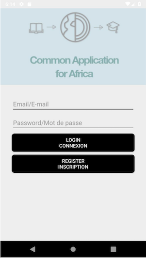
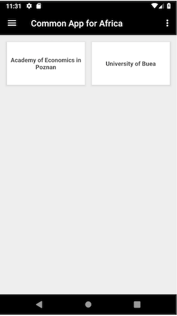

# COMMON APPLICATION FOR AFRICA
Common Application for Africa has been designed and implemented to allow students to apply to an institutions online on a centralized system.

## Screenshots

## Installing Common Application for Africa
Following programs are used to run the application and implement. Click the links to download and install with corresponding operating system if you don't have them installed already.

1. Download and install [Java 8 JDK or latest](https://www.oracle.com/technetwork/java/javase/downloads/index.html)
2. Download and install [Android Studio](https://developer.android.com/studio/) Download latest Android Studio to begin
   Detailed information of installing Android Studio can be found at [Android Studio](https://developer.android.com/studio/)

## Download the Source Code in Two Ways

Clone the public repository through Android Studio
1. Create New Project from Android Studio. Input all necessary information click "Next." Select Phone and Tablet since this will be Mobile Application
2. Gradle will run
3. Once new project is generated, go to VCS -> Checkout from Version Control -> click "Git"
4. When Git window prompt, go back to [public repository](https://github.com/lpark9/CozmoCrew) and copy the url by clicking "Clone or Download"
5. Once copied, go back to Android studio to paste information into Git window and click clone

Clone the public repository through Command Line
1. In the terminal or cmd, `cd` into the directory where you would like to store the source code.
2. Type `git clone https://github.com/lpark9/CozmoCrew.git` to clone
3. Open Android Studio
  1. If prompted with the welcome screen, select "Import project"
  2. If not, go to File -> Import Project
4. Find the directory where you cloned source code above to import project

Having access or permission issue while cloning? Email lpark9@gatech.edu, micah.j.terrell@gatech.edu, minkyung.jo@gatech.edu, danaeblee@gatech.edu, hkim7711@gatech.edu

## Running the application
1. Once everything is installed and imported into Android Studio, click "Run" from Android Studio
2. Select "Run App"
3. Create New Virtual Device, sample could be like "Nexus 5X API 28"
4. Click "Ok" then device will begin operating and Common Application for Africa will prompt

## Common Application for Africa V1.x Release Notes
### New Features
* **Simplified User Interface**: Sidebar menu is designed for user to easily navigate
* **Application Profile** dividend to different sections with dropdown
* **Flexibility**: User can save or delete institution from My Colleges
* **User Profile** enhancement
* **Attachment** feature to allow user to attach necessary image
* Ability to apply through selected institutions
* Ability to save institution into a list as user search through institution list
* User can access institution web through institution list
* Localized into English and French

### Enhancement
* Improved UI
* Bug Fixes

## Contributors
* Lena Park
* Eun Bin Lee
* Min Kyung Jo
* Micah Terrell
* Haerim Kim

## Client
* Isaac Zama